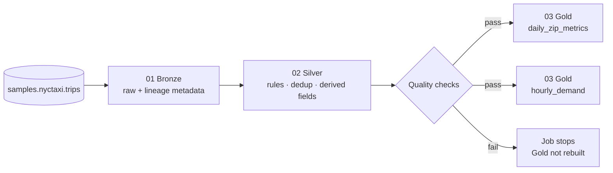

# NYC Taxi Medallion Pipeline on Databricks


A small, production-style **Bronze → Silver → Gold** pipeline built with **PySpark** and **Delta Lake** on Databricks.
It reads the NYC Taxi sample dataset that ships with every Databricks workspace, cleans it with explicit business rules,
blocks bad data with quality checks, and publishes BI-ready Gold tables. It runs end to end on **Databricks Free Edition**
(serverless + Unity Catalog).

## Architecture



| Layer  | Table                          | What it holds                                                                  |
| ------ | ------------------------------ | ------------------------------------------------------------------------------ |
| Bronze | `bronze_trips`                 | Source rows as-is, plus `_ingested_at` and `_source`                            |
| Silver | `silver_trips`                 | Valid, deduplicated trips with `trip_duration_min`, `pickup_date`, `pickup_hour`, `fare_per_mile` |
| Gold   | `gold_daily_zip_metrics`       | Trips, revenue, average fare, distance and duration per pickup date and zip     |
| Gold   | `gold_hourly_demand`           | Trips and average fare by hour of day                                          |

All tables are Delta tables in `<catalog>.<schema>` (default `workspace.nyc_taxi`).

## Silver data quality rules

A trip reaches Silver only if:

- pickup/dropoff timestamps and zip codes are present
- `trip_distance > 0` and `0 < fare_amount <= 500`
- dropoff is after pickup and the trip lasts between 1 and 240 minutes
- it is not an exact duplicate of another trip

After cleaning, `quality.py` checks that Silver is not empty, has no nulls in key columns, and has only positive fares
and distances. If any check fails the job raises `DataQualityError`, so Gold is never rebuilt from bad data.

## Project structure

```
├── databricks.yml              # Asset Bundle definition (variables, targets)
├── resources/
│   └── medallion_job.yml       # 3-task job: bronze -> silver -> gold (serverless)
├── notebooks/                  # thin Databricks notebooks: read -> transform -> write
│   ├── 01_bronze_ingest.py
│   ├── 02_silver_clean.py
│   └── 03_gold_metrics.py
├── src/taxi_pipeline/
│   ├── transforms.py           # pure PySpark transformations (all business logic)
│   └── quality.py              # data quality checks
├── tests/                      # pytest on a local SparkSession
└── .github/workflows/ci.yml    # lint + tests on every push / PR
```

**Design choice:** all business logic lives in plain Python functions (`DataFrame -> DataFrame`) under `src/`.
Notebooks only handle I/O. That makes the logic unit-testable without a Databricks cluster and keeps notebooks easy to read.

## Run it on Databricks

**Option A: Asset Bundle (recommended)**

```bash
# one-time: install the Databricks CLI and log in to your workspace
databricks auth login --host https://<your-workspace>.cloud.databricks.com

databricks bundle validate
databricks bundle deploy
databricks bundle run nyc_taxi_medallion
```

**Option B: Workspace UI**

1. In your workspace, go to **Workspace → Create → Git folder** and paste this repo's URL.
2. Open the notebooks in order (`01` → `02` → `03`) and click **Run all** on each.

Both options create the schema if it does not exist. Change `catalog` / `schema` with the job parameters or notebook widgets.

## Run the tests locally

Requires Python 3.10+ and Java 17.

```bash
python -m venv .venv && source .venv/bin/activate
pip install -r requirements-dev.txt
pytest -v
```

The tests build a small DataFrame with valid rows and one row for each rule violation, then assert what each layer keeps,
derives and aggregates.

## Tech stack

Python · PySpark · Delta Lake · Databricks (serverless, Unity Catalog, Asset Bundles) · pytest · Ruff · GitHub Actions

## Next steps

- Incremental Silver load with `MERGE INTO` instead of full overwrite
- Rebuild the pipeline with Lakeflow Declarative Pipelines and expectations
- Add a Databricks SQL dashboard on top of the Gold tables

---

Author: Oscar Rodríguez Ávalos · Databricks Certified Data Engineer Associate
